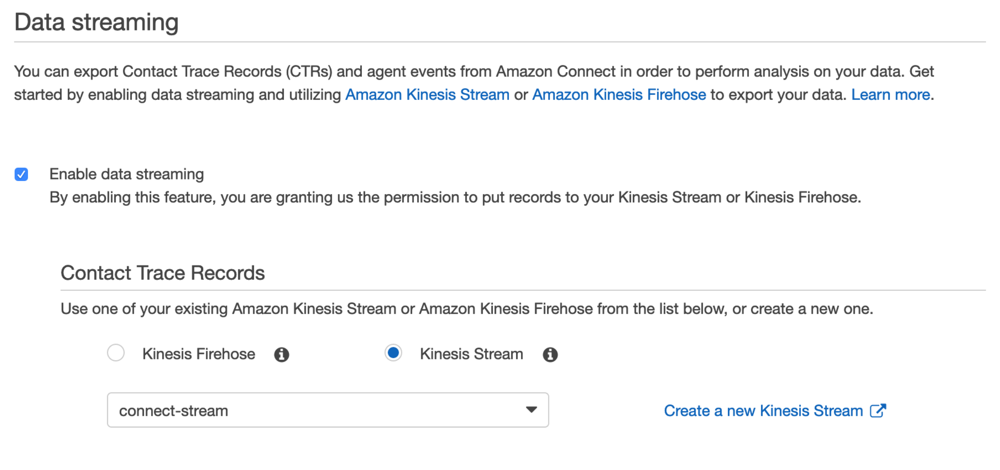

# Contact Trace Record (CTR) Consumer using TypeScript Sample

クラウド型のコンタクトセンターサービス [Amazon Connect](https://aws.amazon.com/jp/connect/) の問い合わせ追跡レコード (CTR) を、[Amazon Kinesis Data Streams](https://aws.amazon.com/jp/kinesis/data-streams/) の API を利用して TypeScript から取得するサンプルです。

## Usage

#### 1. イベントストリームを有効にする

[エージェントイベントストリームを有効にする](https://docs.aws.amazon.com/ja_jp/connect/latest/adminguide/agent-event-streams-enable.html) を参考に、Amazon Connect の Contact Trace Record (CTR) の出力先に、Amazon Kinesis Data Streams を設定します。下図は `connect-stream` という名前の Kinesis Data Stream を CTR の出力先に設定している例です。

**NOTE:** 本実装サンプルから接続する Kinesis Data Stream のシャード数は `1` に設定してください。

<table><tr><td>

</td></tr></table>

#### 2. サンプルコードを修正する

`consumer.ts` の `main` 関数を編集します。`params` の `streamName` に設定した Kinesis Data Stream の名称を指定します。

```diff
...
const main = async () => {
  const params = {
-   streamName: 'KINESIS_STREAM_NAME',
+   streamName: 'connect-stream',
    waitTimeMS: 5000,
    getRecordsLimit: 1000
  }
...
```

#### 3. 認証情報を与え実行する

[認証情報の設定ファイルを作成](https://docs.aws.amazon.com/ja_jp/cli/latest/userguide/cli-configure-files.html)、または [認証情報の環境変数](https://docs.aws.amazon.com/ja_jp/cli/latest/userguide/cli-configure-envvars.html) を与え、`consumer.ts` を起動します。

```sh
npm ci
npm start
```

**NOTE:** 実行したプロセスはマニュアル操作で停止するまでストリームからデータを取得し続けます。

## Manage SequenceNumber

本サンプルでは、Kinesis Data Stream から取得したデータにシーケンス番号が含まれていた場合、シーケンス番号を保存し、次回起動時は保存したシーケンス番号からデータの取得を再開します。<br>

シーケンス番号の保存処理は `saveSequenceNumber` に、シーケンス番号の取得処理は `getSequenceNumber` に実装されています。サンプルではシーケンス番号を簡易的にテキストファイルに保存していますが、ユースケースに応じてデータベースなどに適宜変更してください。

```ts
const saveSequenceNumber = async (sequenceNumber: string) => {
  await fs.writeFile('./sequenceNumber.txt', sequenceNumber, 'utf8')
}
```

```ts
const getSequenceNumber = async (): Promise<null | string> => {
  const sequenceNumber = await fs
    .readFile('./sequenceNumber.txt', 'utf8')
    .catch(() => null)
  return sequenceNumber
}
```

また初回起動の場合など、保存されたシーケンス番号が取得できないケースでは、`ShardIteratorType` に `LATEST` を指定し、最新のデータから取得しています。このためシーケンス番号が保存されておらず、かつイテレーションを実行していない最中に到達した CTR は処理されません。これは初回起動時の他、シーケンス番号の保存に失敗、または保存したシーケンス番号を削除したケースなどに該当します。要件に応じて `ShardIteratorType` を `LATEST` から `TRIM_HORIZON` に変更することで、保存したシーケンス番号がない際に、Kinesis Data Stream の 最初の TRIM されていないデータから読み込むように変更することができます。

## 注意事項

- 本実装サンプルから接続する Kinesis Data Stream のシャード数は 1 に設定してください。
- 取得する CTR は重複する可能性があります。必要に応じて重複を除去する処理を加えてください。詳細は [問い合わせ追跡レコード (CTR) データモデル](https://docs.aws.amazon.com/ja_jp/connect/latest/adminguide/ctr-data-model.html) をご確認ください。

## Security

See [CONTRIBUTING](CONTRIBUTING.md#security-issue-notifications) for more information.

## License

This library is licensed under the MIT-0 License. See the [LICENSE](LICENSE) file.
